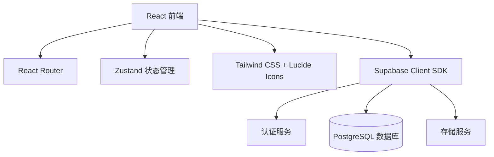
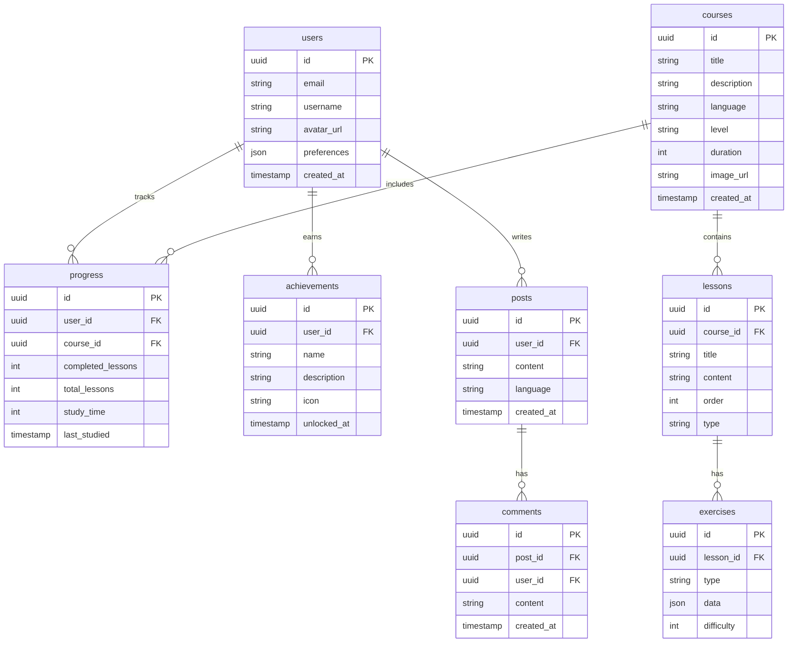

## 1. Architecture Design


## 2. Technology Description
- Frontend: React@18 + TypeScript + tailwindcss@3 + vite
- Initialization Tool: vite-init (react-express-ts template)
- Backend: Supabase
- Database: Supabase (PostgreSQL)
- State Management: Zustand
- Icons: lucide-react

## 3. Route Definitions
| Route | Purpose |
|-------|---------|
| / | 首页 - 语言选择、课程推荐、学习进度 |
| /auth/login | 登录页面 |
| /auth/register | 注册页面 |
| /courses | 课程中心 - 课程列表、课程详情 |
| /learn | 学习模块 - 单词、语法、口语、听力 |
| /progress | 进度追踪 - 学习数据、成就 |
| /community | 社区交流 - 动态、评论 |

## 4. Data Model

### 4.1 Data Model Definition


### 4.2 Data Definition Language
```sql
-- Enable RLS
ALTER TABLE users ENABLE ROW LEVEL SECURITY;
ALTER TABLE courses ENABLE ROW LEVEL SECURITY;
ALTER TABLE lessons ENABLE ROW LEVEL SECURITY;
ALTER TABLE exercises ENABLE ROW LEVEL SECURITY;
ALTER TABLE progress ENABLE ROW LEVEL SECURITY;
ALTER TABLE achievements ENABLE ROW LEVEL SECURITY;
ALTER TABLE posts ENABLE ROW LEVEL SECURITY;
ALTER TABLE comments ENABLE ROW LEVEL SECURITY;

-- Users table
CREATE TABLE users (
    id UUID REFERENCES auth.users NOT NULL PRIMARY KEY,
    email TEXT UNIQUE,
    username TEXT,
    avatar_url TEXT,
    preferences JSONB DEFAULT '{}'::jsonb,
    created_at TIMESTAMP WITH TIME ZONE DEFAULT NOW()
);

-- Courses table
CREATE TABLE courses (
    id UUID DEFAULT gen_random_uuid() PRIMARY KEY,
    title TEXT NOT NULL,
    description TEXT,
    language TEXT NOT NULL,
    level TEXT NOT NULL,
    duration INT,
    image_url TEXT,
    created_at TIMESTAMP WITH TIME ZONE DEFAULT NOW()
);

-- Lessons table
CREATE TABLE lessons (
    id UUID DEFAULT gen_random_uuid() PRIMARY KEY,
    course_id UUID REFERENCES courses(id) ON DELETE CASCADE,
    title TEXT NOT NULL,
    content TEXT,
    order_index INT,
    type TEXT
);

-- Exercises table
CREATE TABLE exercises (
    id UUID DEFAULT gen_random_uuid() PRIMARY KEY,
    lesson_id UUID REFERENCES lessons(id) ON DELETE CASCADE,
    type TEXT NOT NULL,
    data JSONB,
    difficulty INT DEFAULT 1
);

-- Progress table
CREATE TABLE progress (
    id UUID DEFAULT gen_random_uuid() PRIMARY KEY,
    user_id UUID REFERENCES users(id) ON DELETE CASCADE,
    course_id UUID REFERENCES courses(id) ON DELETE CASCADE,
    completed_lessons INT DEFAULT 0,
    total_lessons INT DEFAULT 0,
    study_time INT DEFAULT 0,
    last_studied TIMESTAMP WITH TIME ZONE DEFAULT NOW(),
    UNIQUE(user_id, course_id)
);

-- Achievements table
CREATE TABLE achievements (
    id UUID DEFAULT gen_random_uuid() PRIMARY KEY,
    user_id UUID REFERENCES users(id) ON DELETE CASCADE,
    name TEXT NOT NULL,
    description TEXT,
    icon TEXT,
    unlocked_at TIMESTAMP WITH TIME ZONE DEFAULT NOW()
);

-- Posts table
CREATE TABLE posts (
    id UUID DEFAULT gen_random_uuid() PRIMARY KEY,
    user_id UUID REFERENCES users(id) ON DELETE CASCADE,
    content TEXT NOT NULL,
    language TEXT,
    created_at TIMESTAMP WITH TIME ZONE DEFAULT NOW()
);

-- Comments table
CREATE TABLE comments (
    id UUID DEFAULT gen_random_uuid() PRIMARY KEY,
    post_id UUID REFERENCES posts(id) ON DELETE CASCADE,
    user_id UUID REFERENCES users(id) ON DELETE CASCADE,
    content TEXT NOT NULL,
    created_at TIMESTAMP WITH TIME ZONE DEFAULT NOW()
);

-- Policies
CREATE POLICY "Enable read access for all users" ON courses FOR SELECT USING (true);
CREATE POLICY "Enable read access for all users" ON lessons FOR SELECT USING (true);
CREATE POLICY "Enable read access for all users" ON exercises FOR SELECT USING (true);
CREATE POLICY "Users can view their own progress" ON progress FOR SELECT USING (auth.uid() = user_id);
CREATE POLICY "Users can update their own progress" ON progress FOR ALL USING (auth.uid() = user_id);
CREATE POLICY "Users can view their own achievements" ON achievements FOR SELECT USING (auth.uid() = user_id);
CREATE POLICY "Enable read access for all users" ON posts FOR SELECT USING (true);
CREATE POLICY "Users can create posts" ON posts FOR INSERT WITH CHECK (auth.uid() = user_id);
CREATE POLICY "Enable read access for all users" ON comments FOR SELECT USING (true);
CREATE POLICY "Users can create comments" ON comments FOR INSERT WITH CHECK (auth.uid() = user_id);

-- Grants
GRANT SELECT ON courses TO anon, authenticated;
GRANT SELECT ON lessons TO anon, authenticated;
GRANT SELECT ON exercises TO anon, authenticated;
GRANT ALL ON progress TO authenticated;
GRANT ALL ON achievements TO authenticated;
GRANT SELECT, INSERT ON posts TO authenticated;
GRANT SELECT, INSERT ON comments TO authenticated;
```

