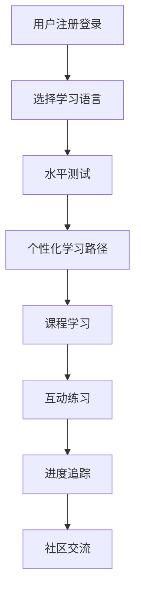

## 1. Product Overview
多语种学习在线教育平台，旨在为用户提供沉浸式语言学习体验，支持英语、日语、韩语等主流语言的学习。
- 为语言学习者提供系统化、互动式的学习路径，涵盖单词记忆、语法练习、口语跟读、听力训练等多种学习方式。

## 2. Core Features

### 2.1 User Roles
| Role | Registration Method | Core Permissions |
|------|---------------------|------------------|
| 学习者 | 邮箱注册 | 使用所有学习功能、查看进度、参与社区 |

### 2.2 Feature Module
1. **首页/导航页**: 语言选择、课程推荐、学习进度概览
2. **用户认证页**: 注册、登录、个人信息管理
3. **课程中心页**: 分级课程体系、课程详情、课程学习
4. **学习模块页**: 单词记忆、语法练习、口语跟读、听力训练
5. **进度追踪页**: 学习数据统计、成就展示
6. **社区交流页**: 动态发布、评论互动

### 2.3 Page Details
| Page Name | Module Name | Feature description |
|-----------|-------------|---------------------|
| 首页 | Hero section | 语言选择、热门课程推荐、学习进度概览 |
| 用户认证页 | 认证模块 | 邮箱注册、登录、密码重置 |
| 课程中心页 | 课程列表 | 按语言和级别筛选课程、课程详情 |
| 学习模块页 | 互动学习 | 单词卡片、语法练习、口语录音、听力测试 |
| 进度追踪页 | 数据展示 | 学习时长、单词量、完成课程数 |
| 社区交流页 | 社交功能 | 动态发布、评论、点赞 |

## 3. Core Process
用户注册登录 → 选择学习语言 → 进行水平测试 → 获得个性化学习路径 → 开始课程学习 → 完成互动练习 → 查看学习进度 → 参与社区交流

## 4. User Interface Design
### 4.1 Design Style
- **主色调**: 蓝色系 (#2563eb, #3b82f6) - 代表知识与专注
- **辅助色**: 绿色 (#10b981) - 代表进步与成就
- **按钮风格**: 圆角按钮，带有轻微阴影，悬停时有缩放效果
- **字体**: 思源黑体 (Inter 替换为 Noto Sans SC 等)
- **布局风格**: 卡片式布局，清晰的视觉层次
- **图标风格**: 使用 Lucide React 图标库，简洁现代

### 4.2 Page Design Overview
| Page Name | Module Name | UI Elements |
|-----------|-------------|-------------|
| 首页 | Hero section | 渐变背景、大标题、语言选择卡片、动画效果 |
| 课程中心页 | 课程卡片 | 课程封面、课程信息、进度条、开始学习按钮 |
| 学习模块页 | 互动练习 | 动画过渡、卡片翻转效果、即时反馈 |

### 4.3 Responsiveness
Desktop-first 设计，支持移动端自适应，触摸优化

